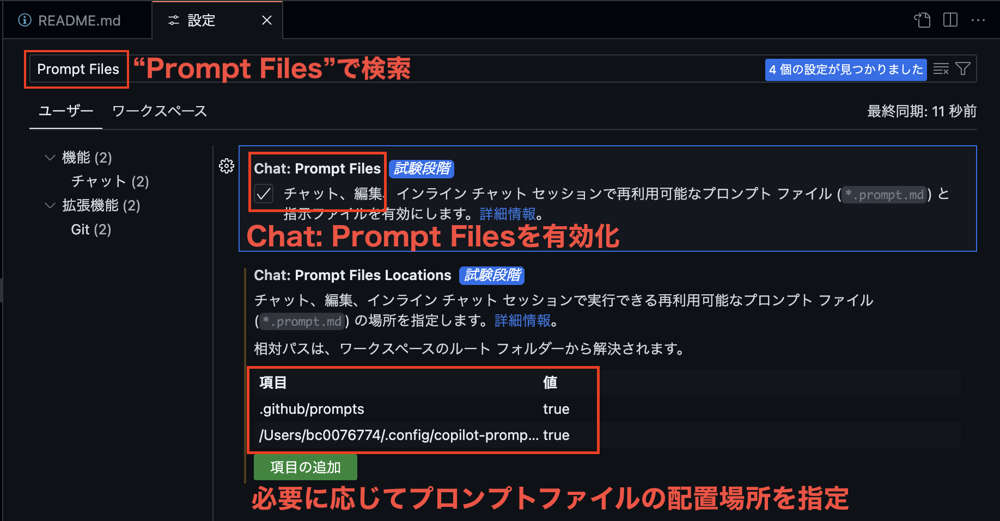
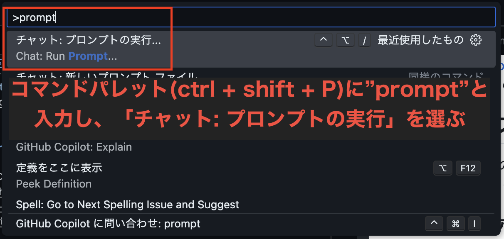
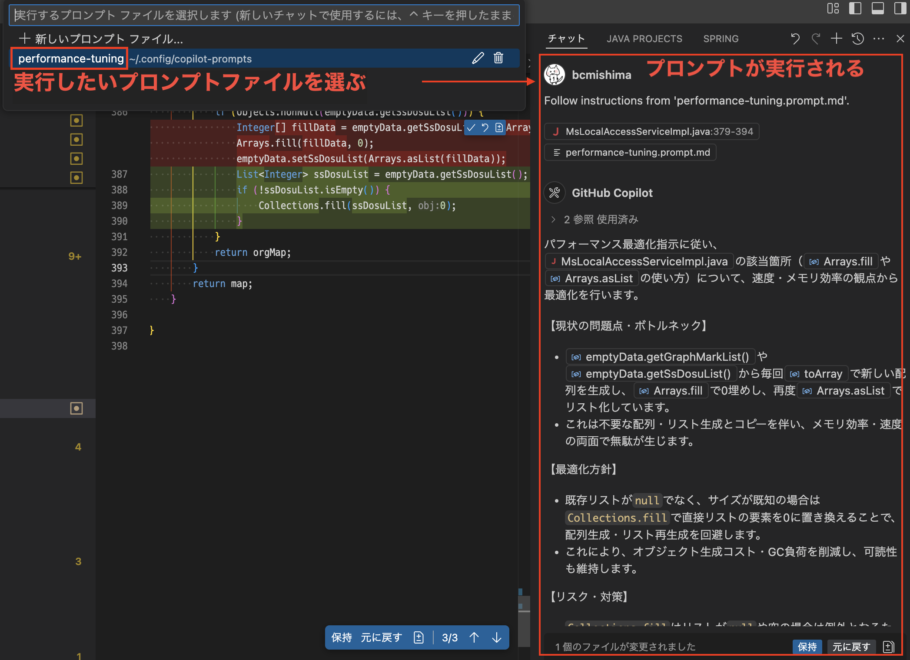
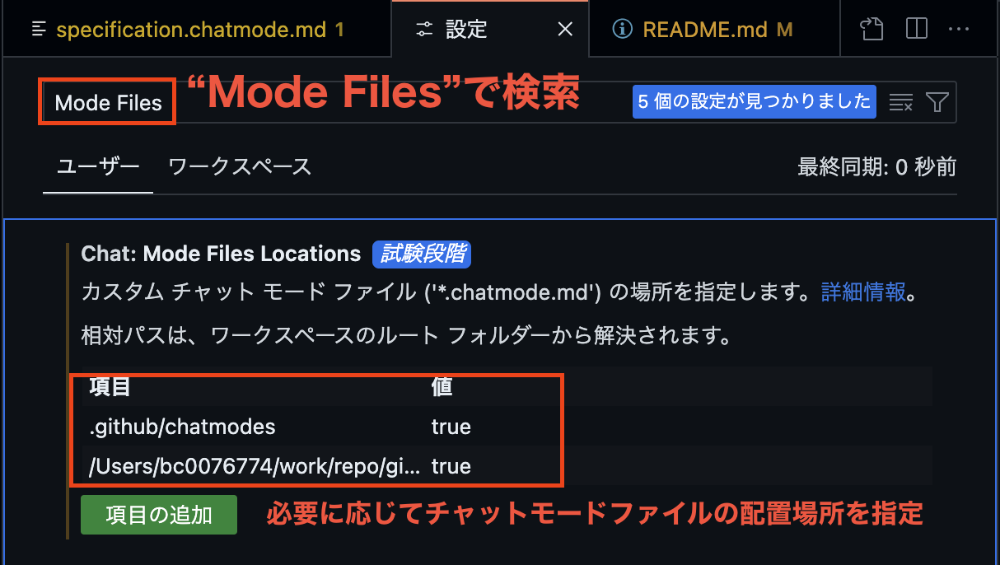
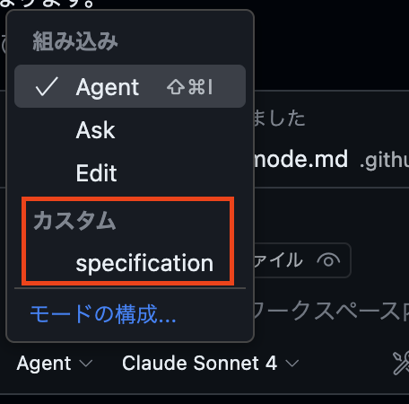

# GitHub Copilot Customization

GitHub Copilotのカスタマイズ方法についてのドキュメントおよびサンプル集です。
2つの主要なカスタマイズ方法として、リポジトリのカスタム命令とプロンプトファイルがあります。
これらを使用することで、GitHub Copilotの動作をプロジェクト固有のニーズに合わせて調整できます。
必要に応じて、ご自身のプロジェクトにリポジトリのカスタム命令やプロンプトファイルをコピーおよび変更してご利用ください。

## リポジトリのカスタム命令

GitHub Copilotのリポジトリカスタム命令を使用して、特定のリポジトリに対してCopilotの動作を調整することができます。これにより、プロジェクト固有のニーズに合わせたコード補完や提案を受けることが可能になります。導入したいリポジトリに`.github/copilot-instructions.md`を作成し、以下から必要な内容をコピーして使用してください。

### リポジトリカスタム命令の使い方

#### 前提条件

設定値`github.copilot.chat.codeGeneration.useInstructionFiles`が`true`に設定されている必要があります。デフォルトでは有効になっています。

#### リポジトリカスタム命令の設定

1. リポジトリのルートディレクトリに`.github/copilot-instructions.md`ファイルを作成します。
2. [リポジトリカスタム命令のテンプレート一覧](#リポジトリカスタム命令のテンプレート一覧)から必要なものをコピーして、`.github/copilot-instructions.md`に貼り付けます。

以下の方法でもリポジトリカスタム命令を追加できます。

1. `.github/instructions`ディレクトリに`.instructions.md`拡張子のファイルを配置する

以上により、GitHub Copilotはリポジトリ固有のカスタム命令を認識し、プロジェクトに適したコード補完や提案を行うようになります。

### リポジトリカスタム命令のテンプレート一覧

| ファイル名                                                                                        | 説明                                           |
| :------------------------------------------------------------------------------------------------ | :--------------------------------------------- |
| [code-quality.instructions.md](.github/instructions/code-quality.instructions.md)                 | コード品質を向上させるためのカスタム命令       |
| [java-springboot.instructions.md](.github/instructions/java-springboot.instructions.md)           | Java Spring Bootプロジェクト向けのカスタム命令 |
| [python-fastapi.instructions.md](.github/instructions/python-fastapi.instructions.md)             | Python FastAPIプロジェクト向けのカスタム命令   |
| [python.instructions.md](.github/instructions/python.instructions.md)                             | Pythonプロジェクト向けのカスタム命令           |
| [tailwindcss.instructions.md](.github/instructions/tailwindcss.instructions.md)                   | Tailwind CSSプロジェクト向けのカスタム命令     |
| [typescript-react.instructions.md](.github/instructions/typescript-react.instructions.md)         | TypeScript Reactプロジェクト向けのカスタム命令 |
| [nextjs-tailwind.instructions.md](.github/instructions/nextjs-tailwind.instructions.md)           | Next.jsとTailwind CSSの開発標準とガイドライン  |
| [nextjs.instructions.md](.github/instructions/nextjs.instructions.md)                             | Next.jsプロジェクト向けのカスタム命令          |
| [codereview-miraiseed.instructions.md](.github/instructions/codereview-miraiseed.instructions.md) | コードレビュー用のカスタム命令                 |
| [benesse-java-dev-manual.instructions.md](./github/instructions/benesse-java-dev-manual.instructions.md)                                 | ベネッセJava開発マニュアルをコピーしたカスタム命令   |

## プロンプトファイル

プロンプトファイルを使うと、GitHub Copilotに特定のプロンプトを素早く提供し、より適切なコード補完や提案を得ることができます。

### プロンプトファイルの使い方

#### Visual Studio Codeの設定

プロンプトファイルを使用するには、Visual Studio Codeの設定で以下の手順を実行します。

1. 設定を開きます。
2. 検索バーに「Prompt Files」と入力します。
3. 「Chat: Prompt Files」を有効にします。
4. 「Chat: Prompt Files Locations」にプロンプトファイルのパスを設定します。例えば、`.github/prompts`ディレクトリや、ローカルパスを指定します。

#### プロンプトファイルの使用

ctrl + shift + P を押してコマンドパレットを開き、「チャット: プロンプトの実行」を選択します。次に、実行したいプロンプトファイルを選択します。プロンプトを選択すると、GitHub Copilotのビューが開き、プロンプトの実行結果が表示されます。

### プロンプトファイル一覧

| ファイル名                                                                   | 説明                                                 |
| :--------------------------------------------------------------------------- | :--------------------------------------------------- |
| [refactoring.prompt.md](.github/prompts/refactoring.prompt.md)               | リファクタリング用のプロンプト                       |
| [performance-tuning.prompt.md](.github/prompts/performance-tuning.prompt.md) | パフォーマンスチューニング用のプロンプト             |
| [review-security.prompt.md](.github/prompts/review-security.prompt.md)       | セキュリティレビュー用のプロンプト                   |
| [readme-creation.prompt.md](.github/prompts/readme-creation.prompt.md)       | README.mdを生成するプロンプト                        |

---

## カスタムチャットモード

GitHub Copilotのカスタムチャットモードを使用すると、「リサーチ」「設計書生成」など特定のタスクやドメインに特化した対話型の支援を受けることができます。以下は、カスタムチャットモードの設定方法と使用例です。

### カスタムチャットモードの使い方

#### Visual Studio Codeの設定

プロンプトファイルを使用するには、Visual Studio Codeの設定で以下の手順を実行します。

1. 設定を開きます。
2. 検索バーに「Chat Files」と入力します。
3. 「Chat: Mode Files Locations」にチャットモードファイルのパスを設定します。例えば、`.github/chatmodes`ディレクトリや、ローカルパスを指定します。
4. 設定したディレクトリに、[カスタムチャットモード一覧](#カスタムチャットモード一覧)から必要なものをコピーします。

> [!NOTE]
> カスタムチャットモードファイルは、`.chatmode.md`拡張子を持つmarkdownファイルである必要があります。

#### カスタムチャットモードの使用

GitHub Copilotのチャットビューを開き、左下のモード選択から使用したいカスタムチャットモードを選択します。選択後、AgentやAskモードと同じくチャットを開始できます。

### カスタムチャットモード一覧

| ファイル名                                                                                | 説明                                           |
| :---------------------------------------------------------------------------------------- | :--------------------------------------------- |
| [specification.chatmode.md](.github/chatmodes/specification.chatmode.md)                 | 仕様書を作成するためのカスタムチャットモード     |

## 参考リンク

- [GitHub Copilot のリポジトリ カスタム命令を追加する](https://docs.github.com/ja/enterprise-cloud@latest/copilot/customizing-copilot/adding-repository-custom-instructions-for-github-copilot?tool=vscode)
- [Customize chat responses in VS Code](https://code.visualstudio.com/docs/copilot/copilot-customization)
- [Chat modes in VS Code](https://code.visualstudio.com/docs/copilot/chat/chat-modes)
